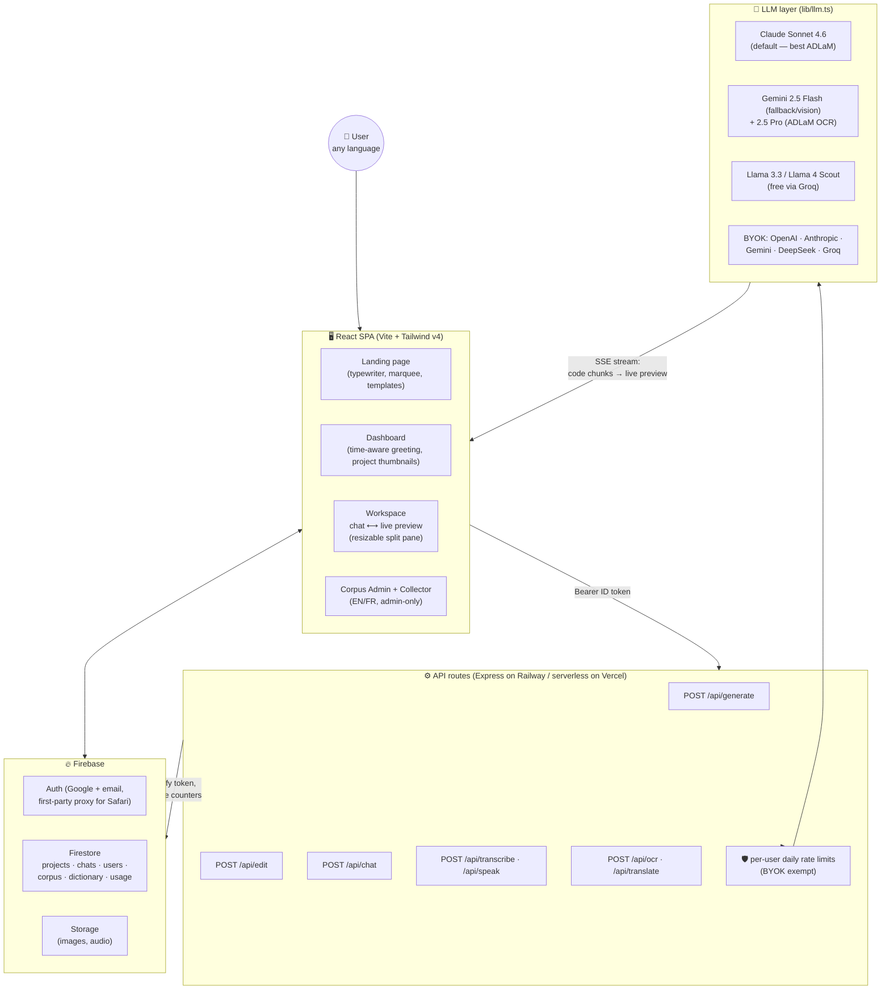
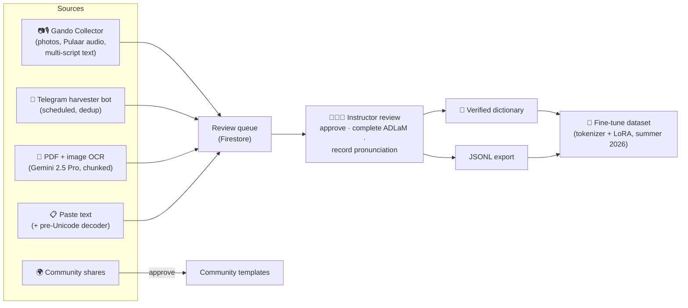
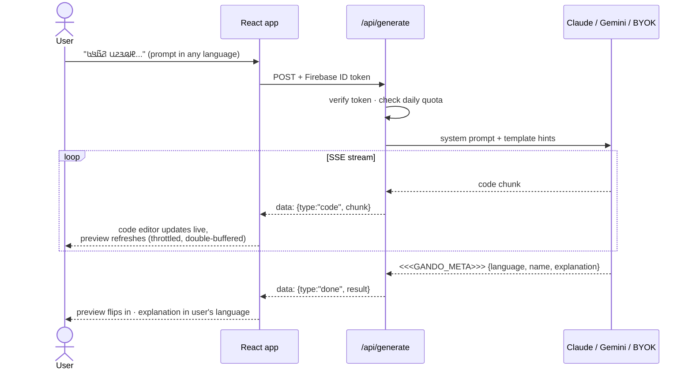

# 𞤘𞤢𞤲𞤣𞤮 — Gando

> 🚀 **[Try it live → gando-ai.up.railway.app](https://gando-ai.up.railway.app)**

## African-Language-First AI App Builder

**Build web apps by describing them in your African language.**
Claude Sonnet 4.6 · Gemini · Llama — React 19 + TypeScript + Firebase

[](LICENSE)
[](https://nodejs.org)
[](https://react.dev)
[](https://www.typescriptlang.org)
[](https://firebase.google.com)

---

## What is Gando?

Gando is a **Bolt/Lovable/v0-style app builder** where the entire experience — landing page, prompts, explanations, and UI chrome — happens in **African languages first**.

Most AI coding tools are English-only, creating a barrier for people who think and create in languages like Fulani, Swahili, Yoruba, or Hausa. Gando removes that barrier:

- **Input** → describe your app in your language (Fulani ADLaM script 𞤀𞤁𞤂𞤀𞤃, French, English, and more)
- **Output** → a working single-file web app, **streamed live** as it's written, with explanations in your language
- **Iterate** → keep chatting to refine; every response saves a snapshot with one-click revert

---

## Architecture



### Corpus pipeline (the road to Gando's own model)



---

> 🤝 **Want to help?** Native Pulaar speakers, ADLaM text data, ML and frontend hands, compute sponsors — see the [Roadmap & How You Can Help](docs/ROADMAP.md).

## Features

### Build experience

- 🌍 **African-language generation** — describe your app in Fulani (ADLaM), French, English, and more
- 🌐 **Publish to a live URL** — one click puts your app at `/p/your-name` (custom link names, old links never break); served with a CSP sandbox so user code can't touch visitors' data
- 📬 **Working forms + owner Inbox** — contact/order forms on published apps actually deliver; submissions land in an Inbox tab on the project (spam honeypot + daily caps built in)
- 📷 **Your photos in your app** — attached images are downscaled in-browser, uploaded to Storage, and embedded in the generated site (up to 6 per message)
- 🧭 **Real multi-page navigation** — generated apps use in-file hash routing: up to ~5 "pages", browser Back/Forward work, no dead links
- ⚡ **Live streaming builds** — code streams into the editor as the model writes it; preview double-buffers with zero flicker
- 🖥 **Resizable split workspace** — VS Code-style drag divider between chat and preview; snap-collapse either side, width remembered
- ✂️ **Surgical edits** — small changes apply as SEARCH/REPLACE patches (~10× fewer tokens, seconds not minutes); a malformed model response changes nothing rather than corrupting your app
- 🩹 **Self-healing preview** — runtime errors and blank screens surface as a one-tap **Fix it** chip; the exact error goes to the model with a minimal-fix instruction
- 💬 **Iterative chat edits** — refine through conversation; incremental edits with version history + one-click revert
- 🖼 **Vision input** — attach an image (sketch, screenshot, photo) and the model *sees* it — sketch-to-app
- 🎙 **Voice in, voice out — real Pulaar** — speak Pulaar and get ADLaM text (Meta MMS speech recognition, Fula-trained, Gemini fallback); hear replies in a Pulaar voice (MMS TTS) with a per-user speed control (1× / 0.8× / 0.7×). Both ride the rule-based ADLaM↔Latin transliterator (`lib/translit.ts`, rules from the official Adlam book) on a self-hosted voice service (free HF Space)
- ⏹ **Stop mid-build** — cancel keeps partial work; stopped-before-code restores your prompt
- 🔀 **Build / Chat modes** — app generation or pure conversation
- 👍👎 **RLHF feedback** — thumbs ratings saved to Firestore for future fine-tuning

### Models

- 🥇 **Claude Sonnet 4.6 default** — won the internal ADLaM eval 10/10; Gemini 2.5 Flash fallback
- 🆓 **Free tier models** — Llama 3.3 70B and Llama 4 Scout via Groq
- 🔑 **BYOK** — bring your own key for OpenAI, Anthropic, Gemini, DeepSeek, or Groq; keys live in your browser only and skip Gando's rate limits

### UI / UX

- 𞤀𞤁𞤂𞤀𞤃 **Full ADLaM script UI** — 160/160 strings translated in all three languages; RTL rendering; ADLaM Display font; correct 𞥟 𞥞 punctuation
- 👋 **Time-aware greeting** — good morning / working late 🌙 / welcome back, in EN, FR, and verified ADLaM, with rotating native variants
- 🧭 **Claude-style shell** — no top bar; brand, search, and language selector live in the sidebar; theme toggle in the avatar menu
- 🔗 **Real URLs** — hash router: back button works, refresh restores your view, `#/project/id` links are shareable
- 🖼 **Live project thumbnails** — dashboard cards render each app's actual HTML, scaled down
- 🌙 **Light / dark themes** — time-of-day auto with manual override, resolved before first paint (no flash)
- 📱 **Dynamic tab title + real 𞤘 favicon** — the browser tab shows what you're working on; favicon is the actual ADLaM capital Ga (SVG + PNG/ICO fallbacks so Safari shows it too)
- 🧭 **Safari-proof previews** — WebKit can't scroll inside sandboxed iframes, and srcdoc hash links navigate the frame away; both worked around so previews scroll and navigate on every browser
- 💬 **WhatsApp-ready link cards** — OG/Twitter meta tags with a branded preview image

### Platform

- 🔐 Firebase Auth (Google + email/password) with a **first-party auth proxy** fixing Safari/iOS sign-in
- 🛡 **Per-user daily rate limits** on generate/edit/chat (Firestore-backed, fail-open, BYOK exempt)
- 💾 Firestore persistence — projects, chats, prefs; landing prompt survives sign-in redirects
- ⚡ **Code-split bundle** — admin tools, code editor, and pdf.js load on demand; stable vendor chunks
- 🟢 System status page — live server / AI / DB health

### ADLaM Corpus Pipeline (Admin — English & French UI)

- 📄 **PDF + image OCR** — upload PDFs *or* JPG/PNG scans; each page renders to lossless PNG (3×) and goes to **Gemini 2.5 Pro** with an anti-hallucination prompt for accurate ADLaM Unicode. Big books OCR ~5 pages in parallel and save in **10-page chunks** — survives interruptions and dodges Firestore's 1 MB doc cap; transient Gemini 5xx auto-retry
- 📋 **Paste text** — encoding inspector flags pre-Unicode Arabic-mapped fonts; **AI decoder** converts them to real ADLaM
- ✅ **Review queue** — approve / reject / complete-the-ADLaM flow with category tagging + instructor audio recording. Rejected items can be **restored** or **permanently deleted** (two-step confirm); approved items can be **edited** or **unverified**; stat cards show accurate server-side totals
- 🏷 **Expandable categories** — 60 built-in domains (animals, housing, clothing, food, livestock, transport land/water/air, colors, body, health…) plus a **"+ Add"** that saves new categories in **English / French / ADLaM**, shared for everyone
- 📖 **Dictionary** — verified term registry (ADLaM · Latin · French) with draft→verified flow and JSON export
- 🌍 **Community moderation** — approve user-shared projects into the public template gallery
- 📤 **JSONL export** — one-click download of the verified corpus for fine-tuning
- 🔤 **Transliterator tab** — live two-way ADLaM↔Latin converter for native-speaker rule review (long vowels 𞥄/𞥅, gemination 𞥆, nyondal — per the official Adlam book)
- 🎙 **Voice Data dashboard** — training-ready (verified + audio) vs awaiting-verification counts, progress bar to the 1,000-clip fine-tune goal, per-clip audio players, JSONL dataset export
- 🤖 **Telegram harvester** — scheduled bot scrapes ADLaM text from groups and the web, dedups, and feeds the queue (separate Railway service)

---

## Tech Stack

| Layer | Technology |
| --- | --- |
| Frontend | React 19, TypeScript, Vite 6, Tailwind CSS v4, motion |
| Fonts | Manrope · Noto Sans Adlam · ADLaM Display (OFL) |
| Backend | Express + tsx (Railway) / serverless functions (Vercel) — shared `lib/` |
| AI | Claude Sonnet 4.6 (`@anthropic-ai/sdk`) · Gemini 2.5 Flash (`@google/genai`) · Groq · BYOK ×5 |
| Auth & Data | Firebase Auth + Firestore (named DB) + Storage |
| Corpus | Python (Telethon + Playwright) scraper — separate Railway service |
| Deploy | Railway (web + scraper) · Vercel (serverless mirror) |

---

## Project Structure

```text
ADLaM_Pulaar/
├── server.ts                     # Express entry — API routes + Vite middleware (dev) / static (prod)
├── api/                          # Vercel serverless mirror of the same routes
│   ├── generate.ts · edit.ts · chat.ts     # SSE streaming generation/edits/chat
│   ├── transcribe.ts · speak.ts            # voice in / voice out
│   ├── ocr.ts · translate.ts · status.ts
│   ├── p/[id].ts                           # public page for published apps (/p/<slug|id>)
│   └── submit/[id].ts                      # public form-submission endpoint
├── lib/
│   ├── llm.ts                    # Provider layer — Claude default, Gemini fallback, Groq, BYOK
│   ├── publishPage.ts            # Published-app serving: slug/id lookup, CSP sandbox, badge
│   ├── submissions.ts            # Form submissions: validation, honeypot, daily caps
│   ├── rateLimit.ts              # Per-user daily quotas (Firestore, fail-open)
│   └── firebaseAdmin.ts          # Server-side token verification (named-DB aware)
├── scraper/                      # Telegram/web ADLaM harvester (Python, own Railway service)
├── scripts/                      # i18n dump/apply tooling, eval harness
├── public/
│   ├── assets/og.png             # Social share card (1200×630)
│   ├── favicon.svg               # Real ADLaM 𞤘 glyph, brand gradient
│   └── fonts/ADLaMDisplay-Regular.woff2
├── src/
│   ├── App.tsx                   # Shell: router, workspace, dashboard, pages
│   ├── translations.ts           # 160 UI strings × (ADLaM · EN · FR)
│   ├── components/
│   │   ├── LandingPage.tsx       # Marketing page + auth modal
│   │   ├── Chat.tsx              # Messages, streaming, voice, attachments, ratings
│   │   ├── Preview.tsx           # Double-buffered sandboxed iframe (mobile-safe scrolling)
│   │   ├── CodeEditor.tsx        # Prism editor (lazy)
│   │   ├── AdminPortal.tsx       # Corpus admin — queue, dictionary, OCR, community (EN/FR)
│   │   ├── GandoCollector.tsx    # Field data collector (lazy)
│   │   ├── ProjectThumb.tsx      # Live mini-preview for project cards
│   │   ├── ByokModal.tsx · SettingsModal.tsx · LanguageSelector.tsx · …
│   ├── data/
│   │   ├── templates.ts          # Starter-template catalog (3 languages)
│   │   └── uiMaps.ts             # Iframe UI translation maps
│   ├── lib/
│   │   ├── greeting.ts           # Time-aware greetings (verified ADLaM phrases)
│   │   ├── providers.ts          # Model/provider registry (single source of truth)
│   │   ├── appImages.ts          # Photo embed: in-browser downscale + Storage upload
│   │   ├── slug.ts               # Custom publish link names (transactional claim)
│   │   ├── adlam.ts              # Latin→ADLaM name transliteration
│   │   └── brand.ts · langs.ts · useTheme.ts · useIsMobile.ts · useVoiceInput.ts
│   ├── services/geminiService.ts # SSE client for /api/*
│   └── contexts/AuthContext.tsx  # Auth state (popup + Safari redirect flow)
├── vercel.json                   # Rewrites + first-party auth proxy
├── railway.toml · railway.scraper.toml
└── firestore.rules
```

---

## Getting Started

### Prerequisites

- Node.js 20+
- An [Anthropic API key](https://console.anthropic.com) (default model) and/or a [Google AI Studio](https://aistudio.google.com) key (fallback + OCR)
- A Firebase project with **Authentication**, **Firestore**, and **Storage** enabled

### 1. Clone & install

```bash
git clone https://github.com/Dialloni/ADLaM_Pulaar.git
cd ADLaM_Pulaar
npm install
```

### 2. Environment variables

```bash
cp .env.example .env
```

```env
# AI providers
ANTHROPIC_API_KEY=sk-ant-...          # default (Claude Sonnet 4.6)
GEMINI_API_KEY=AIza...                # fallback + OCR/vision
GROQ_API_KEY=gsk_...                  # optional free-tier models

# Firebase client
VITE_FIREBASE_API_KEY=...
VITE_FIREBASE_AUTH_DOMAIN=your_project.firebaseapp.com
VITE_FIREBASE_PROJECT_ID=...
VITE_FIREBASE_STORAGE_BUCKET=...
VITE_FIREBASE_MESSAGING_SENDER_ID=...
VITE_FIREBASE_APP_ID=...
VITE_FIREBASE_FIRESTORE_DATABASE_ID=...   # named Firestore DB (not "(default)")

# Firebase server (token verification, rate limits)
FIREBASE_SERVICE_ACCOUNT={"type":"service_account",...}
```

> ⚠️ Never commit `.env` — it is already in `.gitignore`.
> ⚠️ Railway stores env values **with quotes literally** — paste values without surrounding quotes.

### 3. Firebase setup

Enable **Google sign-in** (Authentication → Sign-in method), then for production add your domain to:

1. Firebase Console → Authentication → Authorized Domains
2. Google Cloud Console → Credentials → OAuth Web Client → Authorized JavaScript Origins + Redirect URIs (`/__/auth/handler`)

The app proxies `/__/auth/*` through its own domain so sign-in cookies are first-party (fixes Safari/iOS).

### 4. Run

```bash
npm run dev      # Express + Vite HMR → http://localhost:3000
```

---

## How It Works

### Generation — streamed end to end



The model streams raw HTML first (live preview from the first seconds), then a metadata trailer. Edits reuse the same protocol with the current code + history. Prompts matching known categories (e-commerce, restaurant, booking…) get structural hints for complete, realistic apps.

### ADLaM correctness rules

- Output uses the ADLaM Unicode block **U+1E900–U+1E95F** exclusively — Arabic/Latin lookalikes are rejected by prompt contract
- ADLaM UI text renders **RTL** with `Noto Sans Adlam`; punctuation (𞥟 question, 𞥞 exclamation) sits at the sentence end — leftmost visually
- The app never fabricates ADLaM: UI phrases ship only after native-speaker verification

---

## Supported Languages

| Language                | Generation | UI                   |
| ----------------------- | ---------- | -------------------- |
| Fulani / Pulaar (ADLaM) | ✅         | ✅ full ADLaM UI     |
| English                 | ✅         | ✅                   |
| Français                | ✅         | ✅ (incl. admin)     |
| Swahili · Yoruba · Hausa · Wolof · Amharic · Igbo · Bambara | ✅         | coming soon          |

---

## Scripts

```bash
npm run dev        # dev server (Express + Vite)
npm run build      # production build → dist/
npm run start      # production server
npm run lint       # TypeScript type-check

npx tsx scripts/dump-i18n.ts           # export translation worklist
npx tsx scripts/apply-adlam.ts <file>  # apply verified ADLaM translations
npx tsx scripts/check-translit.ts      # transliterator rule assertions
```

---

## Roadmap

### Next up

- [ ] Dialect tagging in the Collector (Guinea Pular vs Senegal/Mauritania Pulaar) — training-data prerequisite
- [ ] ADLaM eval set (30–50 scored prompts)
- [ ] Glossary + few-shot injection from the verified dictionary (Guinea-dialect steering)
- [ ] Diff-based edits (search/replace blocks — sub-minute edits)
- [ ] Plan-first generation UI (step checkmarks while building)
- [ ] Flagship template rebuild — Gando-built apps replace placeholder templates via the community pipeline
- [ ] Whisper/MMS fine-tune for Pulaar speech (1k–3k clips)
- [ ] Custom ADLaM tokenizer extension + LoRA fine-tune (summer 2026) → **Gando 2.0**

### Shipped

- [x] **Rule-based ADLaM↔Latin transliterator** (`lib/translit.ts`) — conventions from the official Adlam book; powers all voice features + admin test tab
- [x] **ADLaM spelling normalizer** — model output auto-corrected so lengtheners only sit on vowels (𞥄 on 𞤢, 𞥅 on e/i/o/u) and gemination 𞥆 only on consonants
- [x] **Real Pulaar voice** — Meta MMS TTS + speech recognition self-hosted on a free HF Space; speed control; browser/Gemini fallbacks
- [x] **Voice Data dashboard** — training-pair counter (goal 1,000 clips), clip players, JSONL export; instructor verify+record flow feeds it
- [x] Claude Sonnet 4.6 default (internal ADLaM eval winner) with Gemini fallback + Groq free tier
- [x] Live streaming generation with split-screen build view
- [x] Resizable chat/preview split pane with snap-collapse
- [x] BYOK (OpenAI · Anthropic · Gemini · DeepSeek · Groq)
- [x] Vision input (sketch/screenshot → app) + image-in-bubble chat
- [x] Voice input (ADLaM-aware transcription) + TTS replies
- [x] Hash router — back button, refresh-safe, shareable project links
- [x] Per-user daily rate limits (BYOK exempt)
- [x] Time-aware greetings in EN/FR + verified ADLaM (correct 𞥟 𞥞 punctuation)
- [x] Claude-style shell (no top bar), dynamic tab titles, real 𞤘 favicon
- [x] Live project thumbnails on dashboard cards
- [x] OG/Twitter link cards (WhatsApp-ready)
- [x] Corpus Admin in French; dictionary draft→verified flow
- [x] Telegram/web ADLaM harvester (scheduled, deduped)
- [x] **Accurate ADLaM OCR** — Gemini 2.5 Pro + anti-hallucination prompt + lossless PNG render; **PDF or JPG/PNG** upload; parallel page OCR saved in 10-page chunks (interruption-safe, 1 MB-cap-safe) + pre-Unicode ADLaM decoder
- [x] **Expandable corpus categories** — 60 built-in domains + user-added ones (English/French/ADLaM), persisted and shared
- [x] **Review-queue controls** — restore/delete rejected items (two-step confirm), edit/unverify approved items, accurate server-side counts
- [x] RLHF thumbs feedback, stop-mid-build, light/dark by time of day
- [x] Code-split bundle (‑28% first load), Safari first-party auth proxy

---

## Contributing

Pull requests are welcome. For major changes please open an issue first.

1. Fork the repo
2. Create your branch: `git checkout -b feature/my-feature`
3. Commit: `git commit -m "Add my feature"`
4. Push: `git push origin feature/my-feature`
5. Open a Pull Request

---

## License

MIT © [Abubakar Diallo](https://github.com/Dialloni)

---

**𞤘𞤢𞤲𞤣𞤮 — Build apps in your language.**

Made with ❤️ for African language communities.
